## Reproducible Research {visibility="hidden"}

<br>

> "Research is reproducible when others can reproduce the results of a scientific study given only the original data, code, and documentation."

<!-- ::: {.aside} -->
<!-- Source: [@alstonBeginnersGuideConducting2021] -->
<!-- ::: -->

## Reproducible Research Requires: {visibility="hidden"}

1.  **Data** - access to original data.

2.  **Code** - others can read, learn & replicate results.

3.  **Documentation** - complete information about how to conduct the study.

# R Language {background-image="https://www.r-project.org/logo/Rlogo.png" background-size="30%" background-position=75% background-color="silver"}

## Download R Programming Language

<br> <br>

::::: columns
::: {.column width="30%"}

:::

::: {.column width="70%"}
<br>

"R is a free software environment for statistical computing and graphics."
:::
:::::

::: footer
Download R from this link: <https://www.r-project.org/>
:::

## Data Science Project Flowchart

<br>

{fig-align="center"}

::: footer
Image source: <https://r4ds.hadley.nz/>
:::


## Practice in R Console {background-image=images/r-software.png background-size=contain background-position=right}

1.  Addition

1.  Subtraction

1.  Sequence

## Structure of R Function 


## Practice R Console

1.  Combine elements

1.  Create an object

## RStudio IDE

<br> <br>

::::: columns
::: {.column width="25%"}

:::

::: {.column width="75%"}
<br>
"The RStudio integrated development environment (IDE) is a set of tools built to help you be more productive with R and Python."
:::
:::::

::: footer
Download RStudio from this link: <https://posit.co/download/rstudio-desktop/>
:::

## {background-image="https://sara-course-r4b.netlify.app/images/rstd_ide.png" background-size=contain background-position=center background-color=black}

## Practice in RStudio 

1.  An overview of RStudio IDE.

2.  Create project in RStudio.

# R<br>Packages {background-image="images/packages.png" background-size="contain" background-position="right" background-color="silver"}

## R Packages 

> Package is "a collection of [functions, data and documentation]{.rn-fragment rn-color=lightgreen} that extends the capabilties of base R."

. . .

<br>

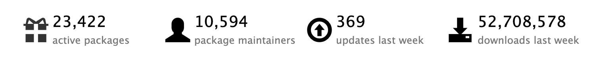{fig-align="center"}


::: footer
Image source: On 13 March 2026 [Metacran](https://www.r-pkg.org/) \| [CRAN](https://cran.r-project.org/web/packages/available_packages_by_name.html).
:::

## Install R Packages {auto-animate=true}

::: {.incremental}

- Using Console

```{.markdown}
# function to install R package
install.packages("tidyverse")

library(tidyverse) #fun to call r package
```

- Using RStudio Windows

:::

# GitHub {background-image="https://upload.wikimedia.org/wikipedia/commons/thumb/c/c2/GitHub_Invertocat_Logo.svg/960px-GitHub_Invertocat_Logo.svg.png" background-size="30%" background-position=75% background-color="silver"}

## GitHub

> "platform that allows developers to create, store, manage, and share their code."

. . .

<br>

> "It uses Git to provide distributed version control"

{width=30% fig-align=center}

::: footer
Source of information <https://en.wikipedia.org/wiki/GitHub>
:::

## Install Git

```{=html}
<iframe width="1100" height="500" src="https://gitforwindows.org/" title="Webpage example"></iframe>
```

::: aside
Webpage: <https://gitforwindows.org/>
:::

## Install Git

::: {layout-ncol="2"}
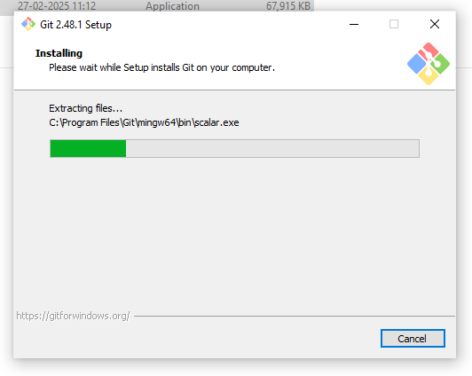

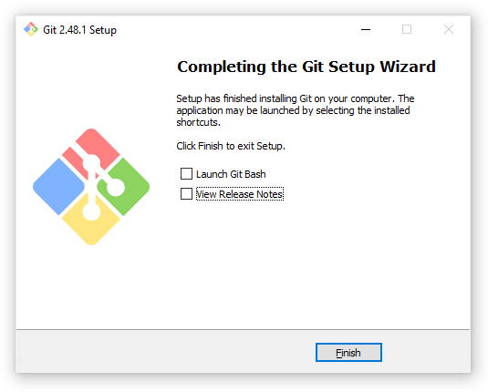
:::

## Open Terminal `git --version`

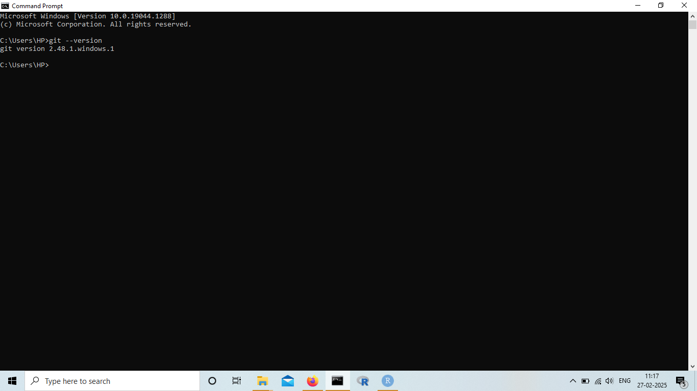


## GitHub Users

<br>

<br>

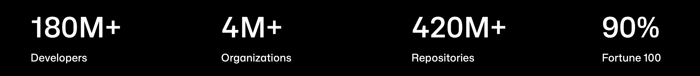

::: footer
Source <https://github.com/about>
:::

## GitHub Sign up {background-color="black" .smaller} 

::::: columns
::: {.column width="50%"}
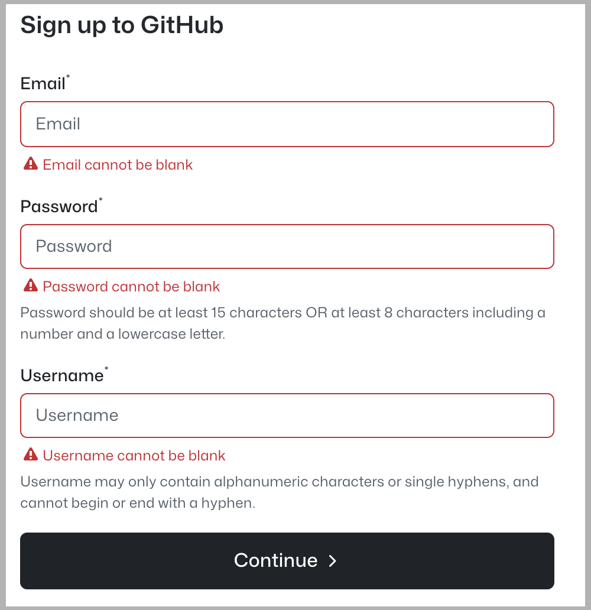
:::

::: {.column width="50%"}
-   **Username advice**
    -   all small cases
    -   use hyphen `-` to separate the words
    -   the shorter the better
    -   make it timeless (do not ajay-jnu, ajay-ny, ajay-microsoft)
    -   avoid special characters
    -   reuse from your social media
    -   comfortable to reveal to the world
:::
:::::

## GitHub Settings {background-color="black"}

::: {layout-ncol="2"}
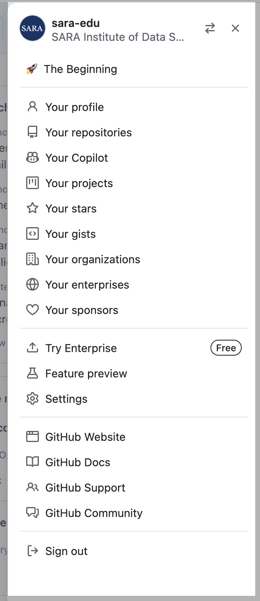

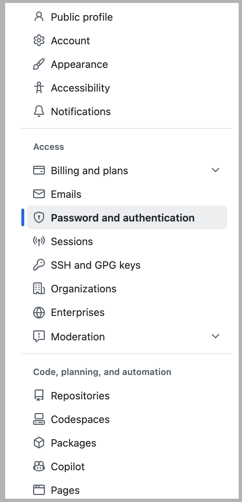
:::

## Enable Two Factor Authentication {background-color="black"}

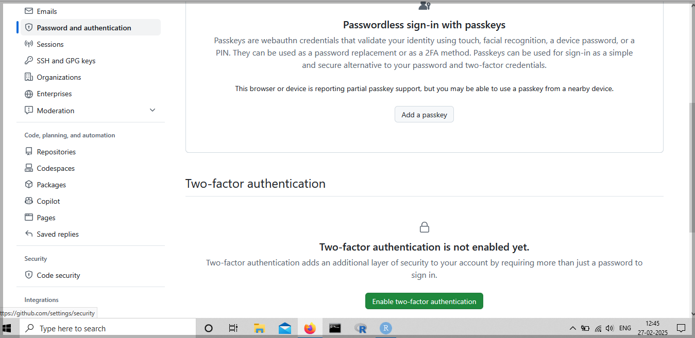

## Enable Two Factor Authentication {background-color="black"}

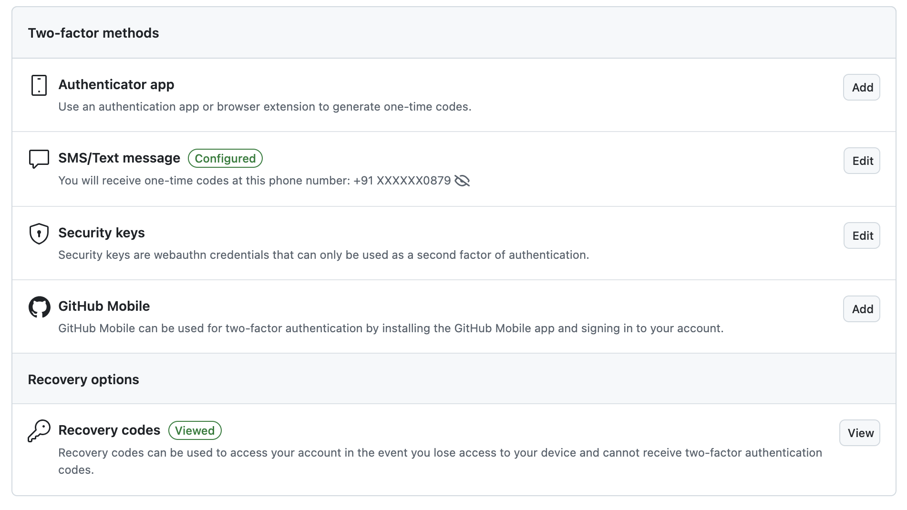

## [RStudio $\rightarrow$ Tools $\rightarrow$ Global Options $\rightarrow$ Git/SVN]{.r-fit-text}

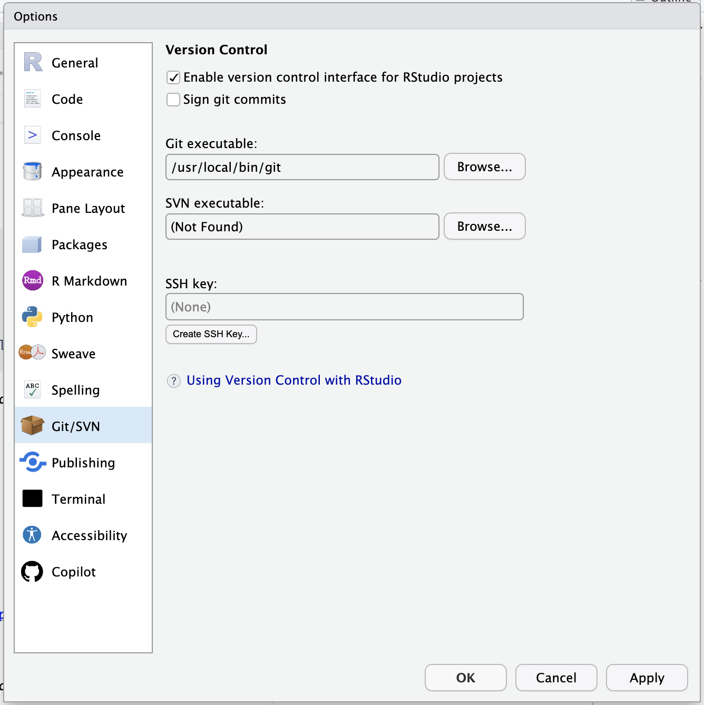{fig-align=center}

## In RStudio save GitHub Details {auto-animate=true}

- Using Console, Install R package `usethis`

```{.markdown}
## install if needed (do this exactly once):
## install.packages("usethis")

library(usethis)
use_git_config(user.name = "ajay-kolii",
               user.email = "mynameajay@gmail.com")
```

::: footer
Read more here: <https://usethis.r-lib.org/articles/git-credentials.html>
:::

## See/Edit saved GitHub information

- Run in console `edit_git_config()` from `usethis` package. OR

- Run in Terminal <br>`git config --global --list`

::: footer
Read more here: <https://usethis.r-lib.org/articles/git-credentials.html>
:::

## GitHub's Personal Access Token (PAT)

<br>

> It is a way to authenticate and interact with GitHub's API and repositories without using your username and password.

## Create GitHub's PAT in Console {auto-animate=true}

```{.markdown}
library(gitcreds)
create_github_token()
```

<br>

. . .

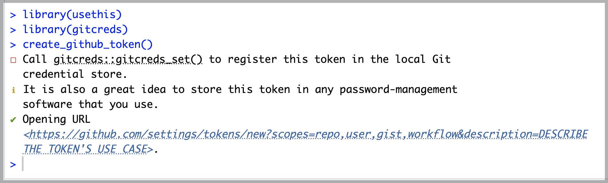


## Personal Access Token (PAT) {background-color="black"}

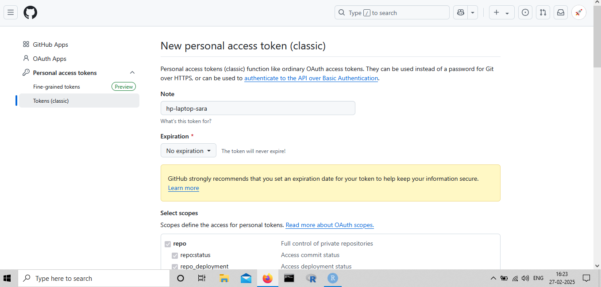

## Personal Access Token (PAT) {background-color="black"}

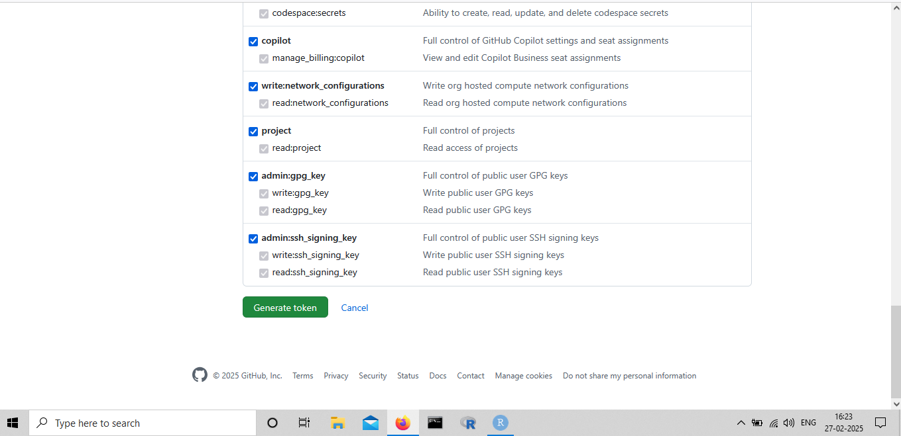

## Add PAT {auto-animate=true}

```{r}
#| eval: false
#| echo: true

gitcreds_set()
```

<br>

. . .

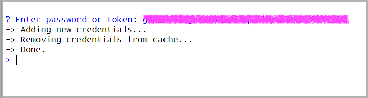

## View GitHub Credentials {auto-animate=true}

```{r}
#| eval: false
#| echo: true

gitcreds_get()
```

<br>

. . .

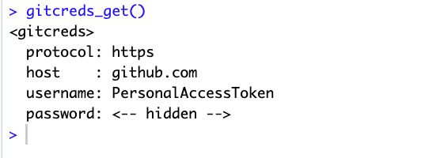

- To See Saved Credentials, Run in Terminal<br>
`git config --global --list`

## First `.qmd` File

1. Create the file

1. Save the file

1. Render the file

## 🤯 Your Turn {background-color="#003263"}

<br>

Write a brief note describing your experience of using R and RStudio for the first time.

```{r}
library(countdown)

countdown(minutes = 5)
```
