# Thesis<br>Structure {background-image=images/thesis-writing.jpg background-size="contain" background-position=110% background-color=silver}

## Set Up GitHub Repo

Create a new GitHub repository (repo) for your book project.

::: {layout="[3,-0.05,7]" layout-valign="bottom"}

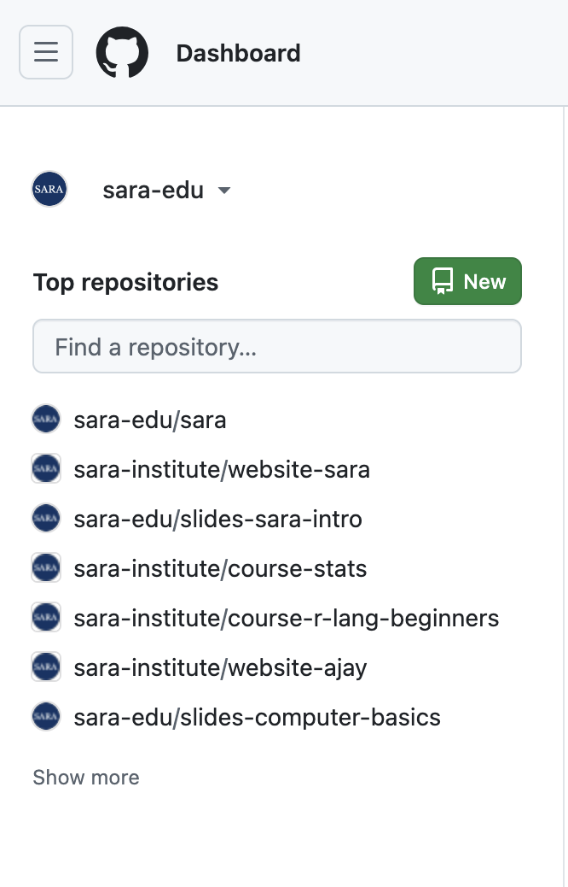

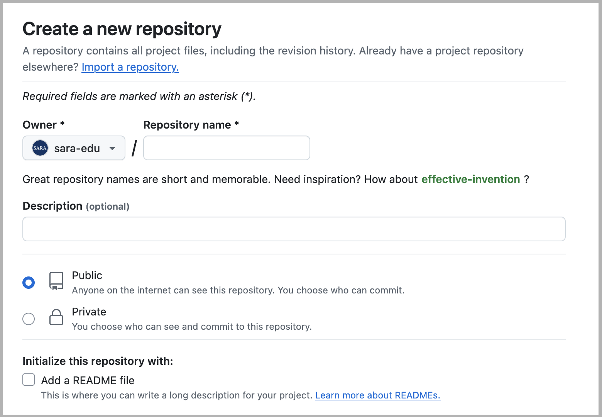
:::

## From Repo Copy the `HTTPS` Link

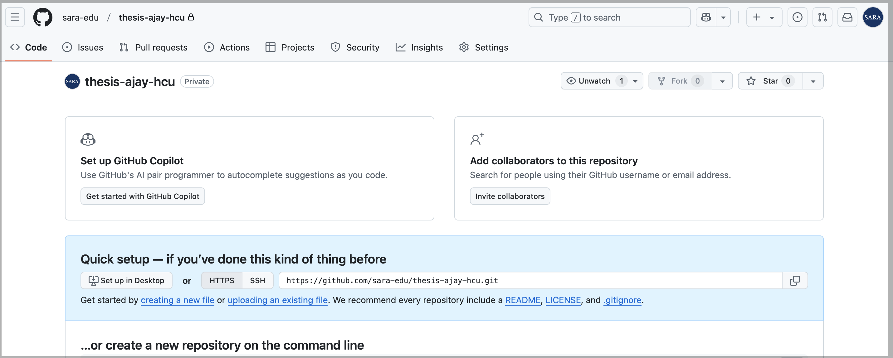

## [Create Version Control RStudio Project]{.r-fit-text}

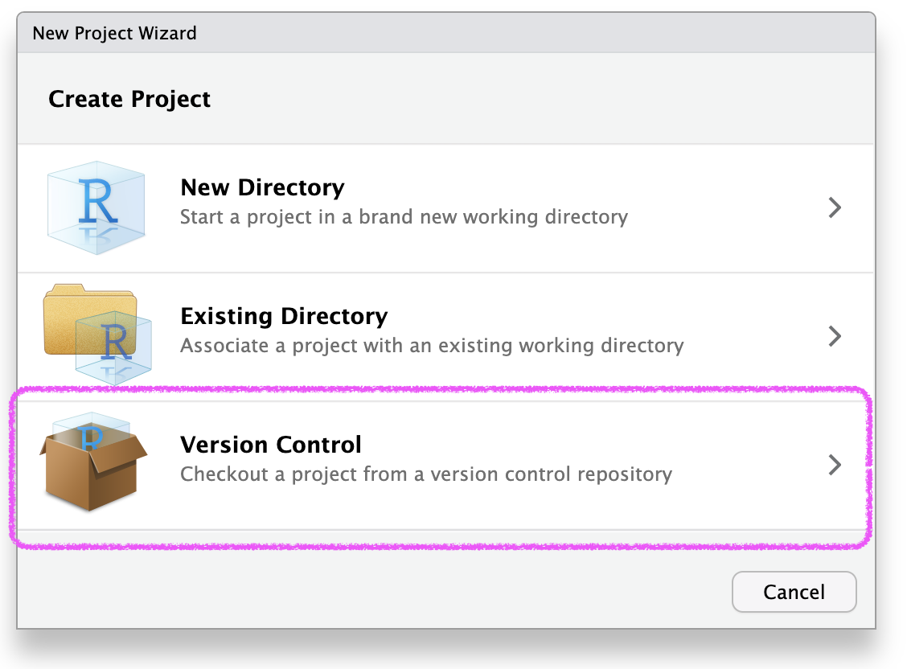{width=70% fig-align=center}

## Paste the Repo Link/URL

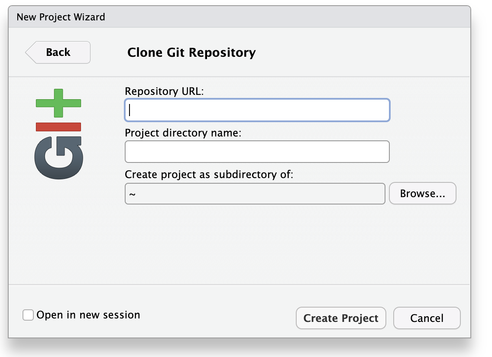{width=70% fig-align=center}

## Set Up RStudio Project

Create a file named **`_quarto.yml`**. It will contain the configuration settings for your thesis.

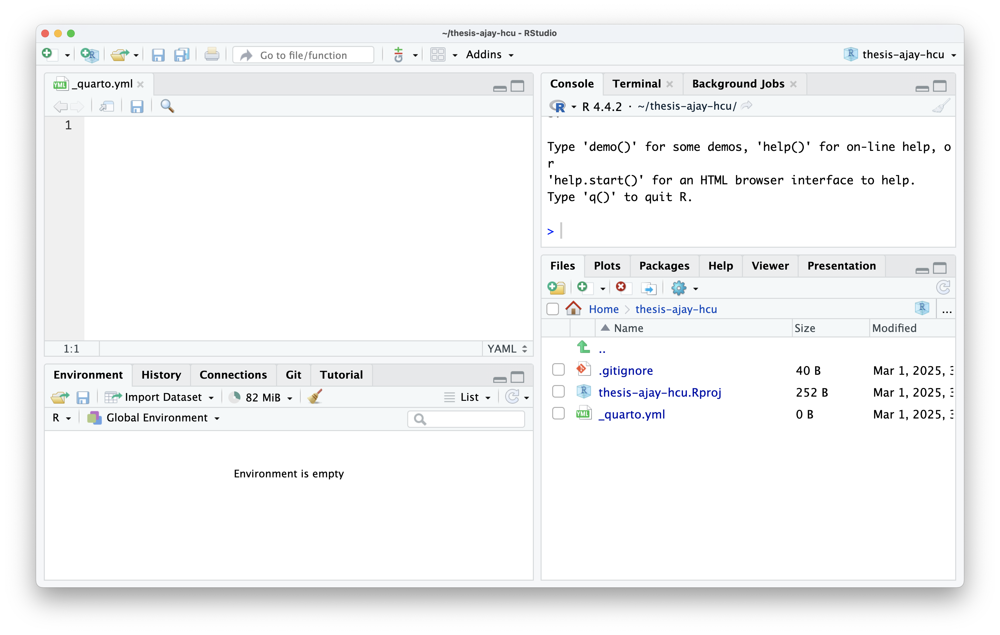{fig-align=center}

## Configure `_quarto.yml`:

```{.yaml code-line-numbers="1-2|4-7|8-11|13-15|16-17"}
project:
  type: book

book:
  title: "My Book Title"
  author: "Author Name"
  date: "2023-10-01"
  chapters:
    - index.qmd
    - chapter1.qmd
    - chapter2.qmd

format:
  html:
    theme: cosmo
  pdf:
    documentclass: scrreprt

```

## Create Content Files

- Create the content files for your chapters (e.g., `index.qmd`, `chapter1.qmd`, `chapter2.qmd`).

- Write your content using Markdown syntax. You can also include code, figures, and other elements.

::: fragment
Example **`index.qmd`**

```markdown
---
format: html
---

# Introduction

Welcome to my book. This is the introduction chapter.
```
:::


::: fragment
Example **`chapter1.qmd`**

```markdown
---
format: html
---

# Chapter 1

This is the content of Chapter 1.
```
:::

## Render the Book

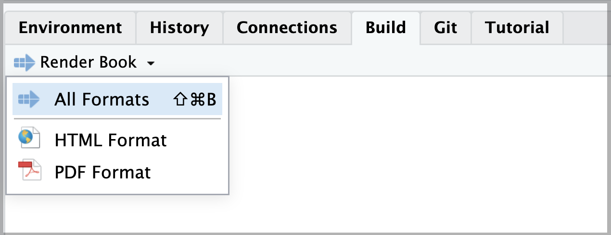

## Preview and Iterate (html)

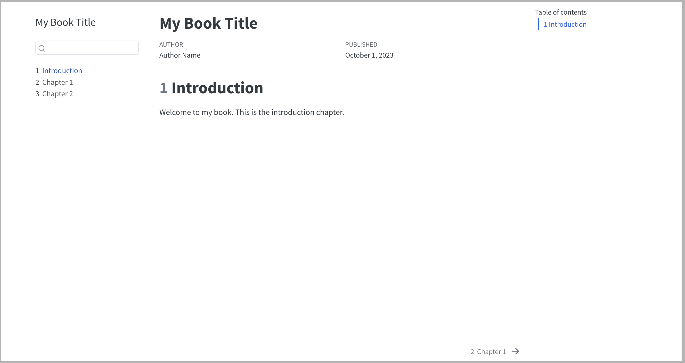

## Preview and Iterate (pdf)

::: {layout-ncol=3}

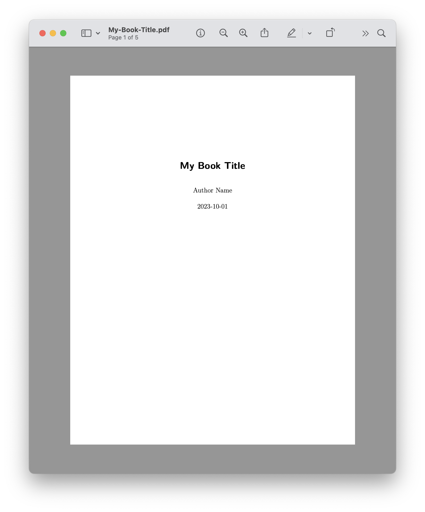

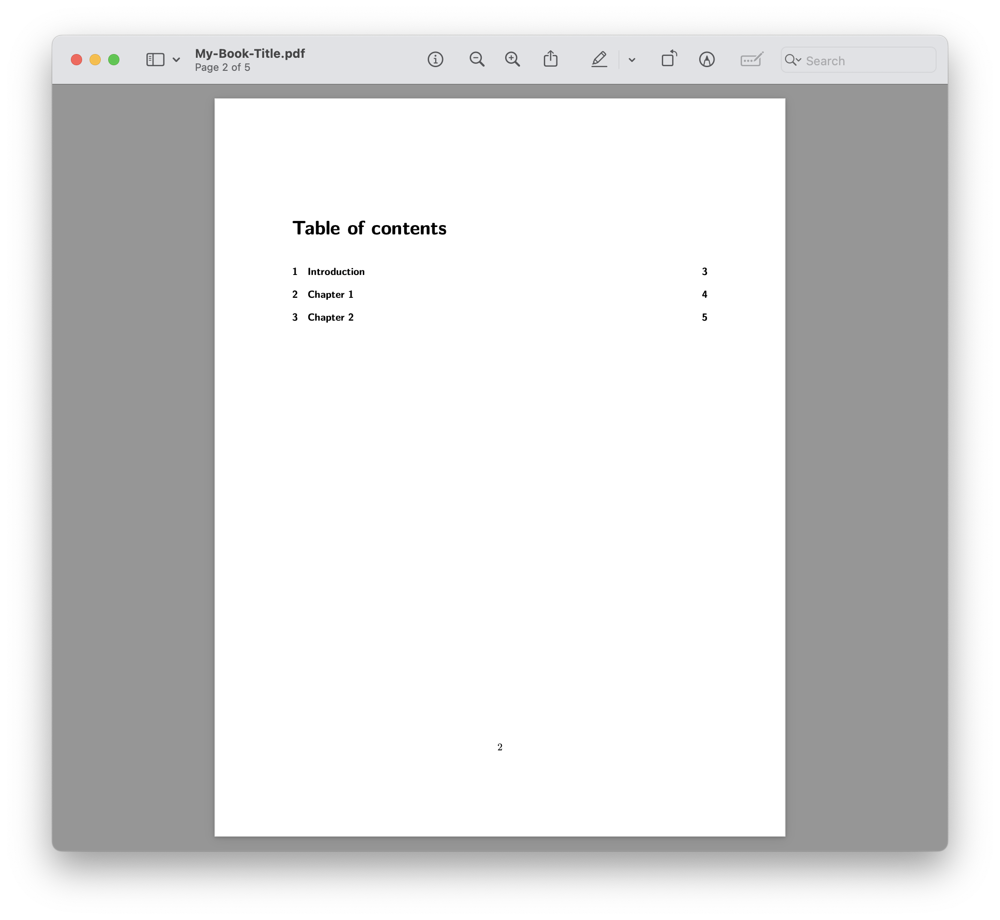

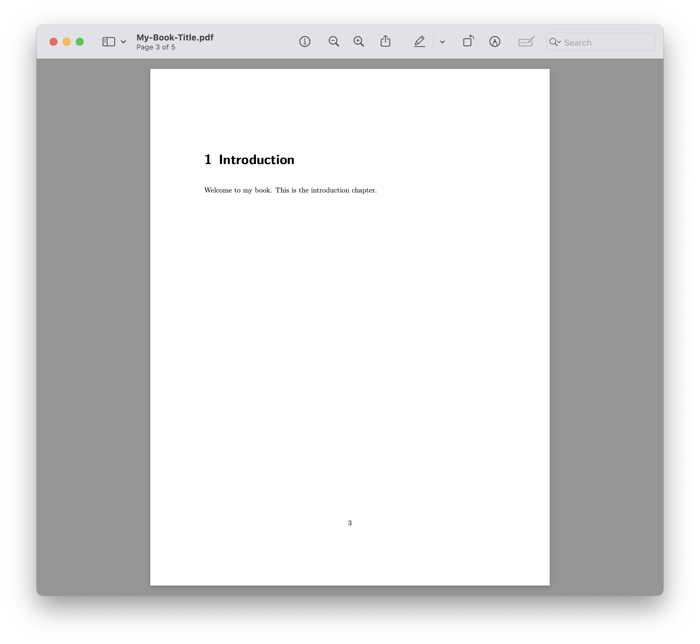

:::

# Thesis Text<br>Formating {background-image=images/thesis-writing.jpg background-size="contain" background-position=110% background-color=silver}

## Markdown

<br>

:::: {.columns}

::: {.column width="30%"}
{fig-align=center}
:::

::: {.column width="70%"}
Markdown is a lightweight markup language for creating **formatted text** using a plain-text editor. Developed by John Gruber in 2004.
:::

::::

::: footer
Source: <https://en.wikipedia.org/wiki/Markdown>
:::

## Text formatting

<br>

+-----------------------------------+-----------------------------------+
| Markdown Syntax                   | Output                            |
+===================================+===================================+
| ``` markdown                      | normal                            |
| normal                            |                                   |
| ```                               |                                   |
+===================================+===================================+
| ``` markdown                      | *italics*                         |
| *italics*                         |                                   |
| ```                               |                                   |
+-----------------------------------+-----------------------------------+
| ``` markdown                      | **bold**                          |
| **bold**                          |                                   |
| ```                               |                                   |
+-----------------------------------+-----------------------------------+
| ``` markdown                      | ***bold italics***                |
| ***bold italics***                |                                   |
| ```                               |                                   |
+-----------------------------------+-----------------------------------+

::: footer
Source: [Quarto guide](https://quarto.org/docs/authoring/markdown-basics.html)
:::

## Text formatting

<br>

+-----------------------------------+-----------------------------------+
| Markdown Syntax                   | Output                            |
+===================================+===================================+
| ``` markdown                      | superscript^2^                    |
| superscript^2^                    |                                   |
| ```                               |                                   |
+===================================+===================================+
| ``` markdown                      | subscript~2~                      |
| subscript~2~                      |                                   |
| ```                               |                                   |
+-----------------------------------+-----------------------------------+
| ``` markdown                      | ~~strike through~~                |
| ~~strike through~~                |                                   |
| ```                               |                                   |
+-----------------------------------+-----------------------------------+
| ``` markdown                      | `verbatim code`                   |
| `verbatim code`                   |                                   |
| ```                               |                                   |
+-----------------------------------+-----------------------------------+

::: footer
Source: [Quarto guide](https://quarto.org/docs/authoring/markdown-basics.html)
:::

## Headings {.smaller}

<br>

+-----------------+-----------------------------------+
| Markdown Syntax | Output                            |
+=================+===================================+
| ``` markdown    | # Header 1 {.heading-output}      |
| # Header 1      |                                   |
| ```             |                                   |
+-----------------+-----------------------------------+
| ``` markdown    | ## Header 2 {.heading-output}     |
| ## Header 2     |                                   |
| ```             |                                   |
+-----------------+-----------------------------------+
| ``` markdown    | ### Header 3 {.heading-output}    |
| ### Header 3    |                                   |
| ```             |                                   |
+-----------------+-----------------------------------+
| ``` markdown    | #### Header 4 {.heading-output}   |
| #### Header 4   |                                   |
| ```             |                                   |
+-----------------+-----------------------------------+
| ``` markdown    | ##### Header 5 {.heading-output}  |
| ##### Header 5  |                                   |
| ```             |                                   |
+-----------------+-----------------------------------+
| ``` markdown    | ###### Header 6 {.heading-output} |
| ###### Header 6 |                                   |
| ```             |                                   |
+-----------------+-----------------------------------+

## Insert links {.scrollable}

<br>

+--------------------------------------+--------------------------------------+
| Markdown syntax                      | Output                               |
+======================================+======================================+
| ``` markdown                         | <https://saraedu.netlify.app/>       |
| <https://saraedu.netlify.app/>       |                                      |
| ```                                  |                                      |
+--------------------------------------+--------------------------------------+

## Insert links {.scrollable}

<br>

+----------------------------------------+--------------------------------------+
| Markdown syntax                        | Output                               |
+========================================+======================================+
| ``` markdown                           | [SARA](https://saraedu.netlify.app/) |
| [SARA](https://saraedu.netlify.app/)   |                                      |
| ```                                    |                                      |
+----------------------------------------+--------------------------------------+

## Add images {.scrollable}

> If image is saved in your computer, <br>``

. . .

<br>

+-------------------------+-----------------------+
| Markdown Syntax         | Output                |
+=========================+=======================+
| ``` markdown            |         |
|           |                       |
| ```                     |                       |
+-------------------------+-----------------------+

## Add images {.scrollable}

> If image is taken from the internet, <br>``

. . .

<br>

:::: {.columns}

::: {.column width="70%"}

```markdown                                                 

```

:::

::: {.column width="30%"}
{width=70%}
:::

::::

## Unordered list {.scrollable} 

<br>

::: nonincremental

+-------------------------+---------------------------------+
| Markdown Syntax         | Output                          |
+=========================+=================================+
| ```markdown             |                                 |
| * Item 1                | * Item 1                        |
| * Item 2                | * Item 2                        |
| * Item 3                | * Item 3                        |
| ```                     |                                 |
+-------------------------+---------------------------------+

:::

## Unordered list: Sub-items {.scrollable} 

<br>

::: nonincremental

+-----------------------------------+---------------------------------+
| Markdown Syntax                   | Output                          |
+===================================+=================================+
| ``` markdown                      |                                 |
| * Main items                      | * Main items                    |
|     + Sub-item 1                  |     + Sub-item 1                |
|     + Sub-item 2                  |     + Sub-item 2                |
|         - Sub-sub-item 1          |         - Sub-sub-item 1        |
| ```                               |                                 |
+-----------------------------------+---------------------------------+

:::


## Ordered list {.scrollable} 

<br>

::: nonincremental

+-----------------------------------+---------------------------------+
| Markdown Syntax                   | Output                          |
+===================================+=================================+
| ``` markdown                      |                                 |
| 1. Eggs                           |  1. Eggs                        |
| 1. Tea                            |  1. Tea                         |
| 1. Fish                           |  1. Fish                        |
| 1. Milk                           |  1. Milk                        |
| ```                               |                                 |
+-----------------------------------+---------------------------------+

:::

## List {.scrollable} 

<br>

::: nonincremental

+-----------------------------------+---------------------------------+
| Markdown Syntax                   | Output                          |
+===================================+=================================+
| ``` markdown                      |                                 |
| (@)  A list whose numbering       |  (1) A list whose numbering     |
|                                   |                                 |
| continues after                   |  continues after                |
|                                   |                                 |
| (@)  an interruption              |  (2) an interruption            |
| ```                               |                                 |
+-----------------------------------+---------------------------------+

:::

## List {.scrollable} 

<br>

::: nonincremental

+-----------------------------------+---------------------------------+
| Markdown Syntax                   | Output                          |
+===================================+=================================+
| ``` markdown                      |                                 |
| ::: {}                            | ::: {}                          |
| 1. A item                         | 1. A item                       |
| 1. B item                         | 1. A item                       |
| :::                               | :::                             |
|                                   |                                 |
| ::: {}                            | ::: {}                          |
| 1. Followed by another list       | 1. Followed by another list     |
| :::                               | :::                             |
| ```                               |                                 |
+-----------------------------------+---------------------------------+

:::


## Equations

> Use `$` delimiters for inline math.

<br>

. . .

+-------------------------------------+-----------------------------------+
| Markdown Syntax                     | Output                            |
+=====================================+===================================+
| ``` markdown                        |                                   |
| It is a great equation $E = mc^{2}$ | It is a great equation $E=mc^{2}$ |
| ```                                 |                                   |
+-------------------------------------+-----------------------------------+

## Equations

> Use `$$` delimiters for display math.

<br>

. . .

+---------------------------------------+-------------------------------------+
| Markdown Syntax                       | Output                              |
+=======================================+=====================================+
| ``` markdown                          |                                     |
| It is a great equation $$E = mc^{2}$$ | It is a great equation $$E=mc^{2}$$ |
| ```                                   |                                     |
+---------------------------------------+-------------------------------------+

::: aside
Learn more about [Latex](https://www.overleaf.com/learn/latex/Mathematical_expressions) math expressions
:::

## In-line coding

> `` `{r} ` ``

```{r}

age <- c(1, 2, 3, 4, 5)

```

```{{r}}

age <- c(1, 2, 3, 4, 5)

```

**Input:** The mean age of the participants is `` `{{r}} mean(age)` ``.

**Output:** The mean age of the participants is `{r} mean(age)`.

# Tables,<br>Figures &<br>Data in<br>a Thesis {background-image=images/thesis-writing.jpg background-size="contain" background-position=110% background-color=silver}

## What We Will Cover Now

::: {.incremental}
- 📊 Adding Tables (Markdown → kable → kableExtra)
- 🖼️ Adding Figures (Images → Code → ggplot)
- 🔗 Cross-Referencing Tables & Figures
- 📁 Loading & Displaying Real Data
- 🎯 Hands-on Your Turn Exercises
:::

# 📊 Adding Tables {background-color="#2d4a6b"}

## Step 1: Markdown Table (Simplest)

Type this in your `.qmd` file:

```markdown
| Name  | Age | City     |
|-------|-----|----------|
| Ajay  | 25  | Delhi    |
| Kiram | 30  | Sonipat  |
```

**Output:**

| Name  | Age | City     |
|-------|-----|----------|
| Ajay  | 25  | Delhi    |
| Kiram | 30  | Sonipat  |


## Step 2: kable Table

```{{r}}
# call the r package
library(knitr)

kable(head(mtcars), 
      caption = "My First Table")
```

<br>

::: {.callout-note}
`kable()` is the go-to function for simple, clean tables in R.
:::

---

## Step 3: kableExtra (Styled Tables)

```{{r}}
library(kableExtra)

kable(head(mtcars), caption = "Styled Table") |>
  kable_styling(
    bootstrap_options = "striped",
    full_width = FALSE
  )
```

::: {.incremental}
- `striped` — alternating row colors
- `hover` — highlight on mouse hover
- `condensed` — compact layout
:::

---

## 🎯 Your Turn: Tables {background-color="#003262"}

```{r}
library(countdown)

countdown(minutes = 10)
```

::: {.callout-important}
## Exercise 1
Create a table showing **5 rows** of any dataset of your choice.

✅ Add a caption  
✅ Make it striped  
✅ Set `full_width = FALSE`
:::

# 🖼️ Adding Figures {background-color="#2d4a6b"}

---

## Step 1: Insert an External Image

```markdown
{
  fig-alt="description" 
  width="70%"
}
```

<br>

::: {.callout-tip}
Always add `fig-alt` for accessibility — it's good research practice!
:::

---

## Step 2: Figure from R Code

```{{r}}
#| label: fig-cars
#| fig-cap: "Relationship between Speed and Distance"

plot(cars$speed, cars$dist,
     xlab = "Speed", ylab = "Distance")
```

::: {.incremental}
- `label` — must start with `fig-` for cross-referencing
- `fig-cap` — your figure caption
:::

---

## Step 3: ggplot Figure

```{{r}}
#| label: fig-ggplot
#| fig-cap: "MPG by Cylinder Count"
#| fig-width: 6
#| fig-height: 4
#| eval: false

library(ggplot2)

ggplot(mtcars, aes(x = factor(cyl), y = mpg)) +
  geom_boxplot(fill = "steelblue") +
  labs(x = "Cylinders", y = "MPG")
```

---

## 🎯 Your Turn: Figures {background-color="#003262"}

```{r}
countdown(minutes = 10)
```

::: {.callout-important}
## Exercise 2

::: {.nonincremental}
1. Insert any image from your computer  
2. Create a `ggplot` figure using the `iris` dataset  
3. Add a proper caption using `fig-cap`  
4. Set figure width and height
:::

:::

# 🔗 Cross-Referencing {background-color="#2d4a6b"}

## Why Cross-Reference?

In a thesis, you write:

> *"As shown in **Figure 3.2**, the results indicate..."*

Quarto handles the **numbering automatically** - you just use labels!

## Cross-Referencing Figures

**In your code chunk:**
```markdown
#| label: fig-scatter
```

**In your text:**
```markdown
As shown in @fig-scatter, there is a positive trend...
```

<br>

::: {.callout-warning}
## Important Rule
Figure labels **must start with** `fig-`  
Table labels **must start with** `tbl-`
:::

## Cross-Referencing Tables

**In your code chunk:**
```markdown
#| label: tbl-summary
```

**In your text:**
```markdown
As seen in @tbl-summary, the results indicate...
```

<br>

Quarto automatically converts `@tbl-summary` $\rightarrow$ **Table 1**

---

## 🎯 Your Turn: Cross-Referencing {background-color="#003262"}

```{r}
countdown(minutes = 10)
```

::: {.callout-important}
## Exercise 3

::: {.nonincremental}
1. Create **one table** with a `tbl-` label  
2. Create **one figure** with a `fig-` label  
3. Reference **both** somewhere in your text using `@`  
4. Render and check the automatic numbering
:::
:::

# 📁 Real Data in Your Thesis {background-color="#2d4a6b"}

## Loading Data

```{{r}}
# CSV file
data <- read.csv("data/survey.csv")

# Excel file
library(readxl)
data <- read_excel("data/survey.xlsx")

# Built-in dataset
data <- mtcars
```

## Displaying Data as a Table

```{{r}}
#| label: tbl-data
#| tbl-cap: "Summary of Survey Data"

library(knitr)

kable(head(data))
```

---

## Creating a Figure from Real Data

```{{r}}
#| label: fig-data
#| fig-cap: "Distribution of Responses"

hist(data$age, 
     main = "", 
     xlab = "Age",
     col = "steelblue")
```

## 🎯 Your Turn: Real Data {background-color="#003262"}

```{r}
countdown(minutes = 10)
```

::: {.callout-important}
## Exercise 4
Using the built-in `airquality` dataset:

::: {.nonincremental}
1. Display the **first 6 rows** as a kable table  
2. Create a **histogram** of the `Temp` column  
3. Add proper captions to both  
4. Cross-reference them in a short paragraph
:::

:::

# 📐 Thesis-Specific Settings {background-color="#2d4a6b"}

---

## Global Settings in `_quarto.yml`

```yaml
execute:
  echo: false       # hide code in final thesis
  warning: false    # hide warnings
  message: false    # hide messages

format:
  html:
    fig-width: 7
    fig-height: 5
```

<br>

::: {.callout-tip}
Set `echo: false` globally so your thesis shows **only output**, not code.
:::

## Useful Chunk Options

| Option | Purpose |
|--------|---------|
| `echo: false` | Hide code, show output |
| `eval: false` | Show code, don't run it |
| `fig-width: 7` | Set figure width |
| `fig-height: 5` | Set figure height |
| `tbl-cap` | Add table caption |
| `fig-cap` | Add figure caption |

## Key Takeaway 

::: {.r-fit-text}
In a Quarto thesis, **everything is connected**
:::

Your data, code, and writing live in **one place**.

When data changes → tables and figures **update automatically**.

::: {.callout-note}
That is **Reproducible Research** in action! 🎉
:::

# Add<br>References {background-image=images/thesis-writing.jpg background-size="contain" background-position=110% background-color=silver}

## What We Will Cover Now

::: {.incremental}
- 📖 What is Zotero and why use it?
- ⚙️ Setting up Zotero with Quarto
- 📝 Adding a bibliography to your thesis
- ✍️ Inserting citations in your text
- 🎨 Changing citation styles (APA, Chicago, etc.)
- 🔗 Connecting Zotero directly in RStudio
- 🎯 Hands-on Your Turn Exercises
:::

# 📖 What is Zotero? {background-color="#2d4a6b"}

---

## Zotero — Simply Put

Think of Zotero as a **smart bookshelf** for your research.

::: {.incremental}
- 📚 Saves all your papers, books, and articles in one place
- 🏷️ Stores author, year, title, journal — automatically
- 📤 Exports references in any format Quarto needs
- 🔄 Syncs across devices via zotero.org
:::

::: {.callout-note}
Zotero is **free and open source** — perfect for researchers!
:::

## Why Zotero + Quarto?

| Without Zotero | With Zotero + Quarto |
|----------------|----------------------|
| Type references manually | References inserted automatically |
| Format APA by hand | Style applied instantly |
| Risk of typos | Always accurate |
| Hard to update | One click to refresh |
| Separate reference list | Auto-generated bibliography |

# ⚙️ Setting Up Zotero {background-color="#2d4a6b"}

## Step 1: Install Zotero

::: {.incremental}
1. Go to **[zotero.org](https://www.zotero.org)** and download Zotero
2. Install the **Zotero Connector** browser extension
3. Create a free account at **zotero.org/user/register**
4. Sign in inside the Zotero app
:::

::: {.callout-tip}
The browser extension lets you **save a paper in one click** while browsing Google Scholar or any journal website.
:::

## Step 2: Add References to Zotero

**Three easy ways:**

::: {.incremental}
- 🌐 **Browser Connector** — click the Zotero icon while on any paper page
- 🔍 **Search by DOI/ISBN** — Edit → Add Item by Identifier
- 📄 **Import PDF** — drag and drop a PDF into Zotero
:::

## Step 3: Install Better BibTeX Plugin

This plugin exports your library in a format Quarto understands.

::: {.incremental}
1. Go to **[github.com/retorquere/zotero-better-bibtex](https://github.com/retorquere/zotero-better-bibtex/releases)**
2. Download the `.xpi` file
3. In Zotero → **Tools → Add-ons → Install Add-on From File**
4. Select the downloaded `.xpi` file
5. Restart Zotero
:::

## Step 4: Export Your Library as `.bib`

::: {.incremental}
1. In Zotero, right-click your collection
2. Select **Export Collection**
3. Choose format: **Better BibTeX**
4. ✅ Check **Keep Updated** — auto-syncs when you add new references!
5. Save as `references.bib` inside your Quarto project folder
:::

::: {.callout-warning}
Save the `.bib` file in the **same folder** as your `_quarto.yml`
:::

# 📝 Linking Bibliography in Quarto {background-color="#2d4a6b"}

## Add Bibliography to `_quarto.yml`

```yaml
project:
  type: book

book:
  title: "My Thesis"
  author: "Your Name"

bibliography: references.bib
csl: apa.csl                  # citation style (optional)

format:
  html:
    theme: cosmo
  pdf:
    documentclass: scrreprt
```

::: {.callout-note}
`bibliography:` tells Quarto where your references file lives.
:::

## Or Add to a Single Chapter's YAML

If you only want bibliography in one `.qmd` file:

```yaml
---
title: "Literature Review"
bibliography: references.bib
csl: apa.csl
---
```

# ✍️ Inserting Citations in Text {background-color="#2d4a6b"}

## Citation Syntax — The Basics

Every reference in your `.bib` file has a **citation key** like:

```
@peng2011reproducible
@wickham2016ggplot2
@gandrud2016reproducible
```

## How to Cite in Text

| What you want | Syntax | Output |
|---------------|--------|--------|
| Author (Year) | `@peng2011` | Peng (2011) |
| (Author, Year) | `[@peng2011]` | (Peng, 2011) |
| Multiple sources | `[@peng2011; @knuth1984]` | (Peng, 2011; Knuth, 1984) |
| Page number | `[@peng2011, p. 45]` | (Peng, 2011, p. 45) |
| Suppress author | `[-@peng2011]` | (2011) |


## Example in Your Thesis Text

```markdown
Reproducible research has been defined as sharing data and 
code alongside findings [@peng2011].

As @buckheit1995 argued, the actual scholarship is the 
complete software environment that produced the results.

Several studies [@peng2011; @gandrud2016; @knuth1984] 
have emphasized the importance of literate programming.
```

## The Bibliography Appears Automatically!

At the end of your document, Quarto automatically generates:

```
## References

Peng, R. D. (2011). Reproducible research in computational 
science. *Science*, 334(6060), 1226–1227.

Buckheit, J., & Donoho, D. (1995). WaveLab and reproducible 
research. *Wavelets and Statistics*, 55–81.
```

::: {.callout-tip}
No need to type the reference list — Quarto does it for you! 🎉
:::

---

## 🎯 Your Turn: First Citation

::: {.callout-important}
## Exercise 1
1. Add **3 references** to your Zotero library  
2. Export as `references.bib` to your project folder  
3. Link it in your `_quarto.yml`  
4. Write one paragraph and cite all 3 sources  
5. Render and check the bibliography at the end
:::

---

# 🎨 Citation Styles {background-color="#2d4a6b"}

---

## What is a CSL File?

**CSL = Citation Style Language**

It controls *how* your citations look:

::: {.incremental}
- **APA** → (Peng, 2011)
- **Chicago** → Peng, Roger D. 2011. "Reproducible Research..."
- **Vancouver** → [1]
- **Harvard** → Peng (2011)
- **IEEE** → [1] R. D. Peng...
:::

---

## Download a CSL File

::: {.incremental}
1. Go to **[zotero.org/styles](https://www.zotero.org/styles)**
2. Search for your required style (e.g., APA 7th)
3. Download the `.csl` file
4. Place it in your **Quarto project folder**
5. Add to `_quarto.yml`:
:::

```yaml
csl: apa.csl
```

---

## Common CSL Files

| Style | File Name | Used In |
|-------|-----------|---------|
| APA 7th | `apa.csl` | Social sciences |
| Chicago | `chicago-author-date.csl` | Humanities |
| Vancouver | `vancouver.csl` | Medicine |
| Harvard | `harvard-cite-them-right.csl` | General |
| IEEE | `ieee.csl` | Engineering |

::: {.callout-tip}
Check with your university which style they require for your thesis!
:::

---

## 🎯 Your Turn: Change Citation Style

::: {.callout-important}
## Exercise 2
1. Download the **APA 7th** CSL file from zotero.org/styles  
2. Place it in your project folder  
3. Add `csl: apa.csl` to your `_quarto.yml`  
4. Render your document  
5. Now switch to **Chicago** style and render again  
6. Compare the difference!
:::

# 🔗 Zotero Direct Integration in RStudio {background-color="#2d4a6b"}

## The Easiest Way — Visual Editor

RStudio's **Visual Editor** connects directly to Zotero!

::: {.incremental}
1. Open your `.qmd` file in RStudio
2. Switch to **Visual mode** (top-left toggle)
3. Go to **Insert → Citation**
4. Search your Zotero library directly!
5. Click **Insert** — citation key added automatically
:::

::: {.callout-note}
No need to remember citation keys — RStudio finds them for you!
:::

## Visual Editor Citation Dialog

```
Insert → Citation

┌─────────────────────────────────┐
│  🔍 Search: reproducible        │
│                                 │
│  📚 My Library                  │
│  ├── Peng 2011                  │
│  ├── Buckheit 1995              │
│  └── Gandrud 2016               │
│                                 │
│  [ Insert ]  [ Cancel ]         │
└─────────────────────────────────┘
```

## Setting Up Zotero in RStudio

Make sure RStudio can find your Zotero:

::: {.incremental}
1. **Tools → Global Options → R Markdown → Citations**
2. Set **Zotero Library** to: Local or Web
3. If Web: add your **Zotero API key** from zotero.org/settings/keys
4. Click **OK**
:::

## Auto-Complete Citation Keys

In **Source mode**, type `@` and start typing:

```markdown
As shown by @pen...
```

RStudio will **autocomplete** from your `.bib` file:

```
@peng2011reproducible  ← select this!
@penman2019...
```

::: {.callout-tip}
This works like autocomplete in coding — fast and accurate!
:::

## 🎯 Your Turn: Visual Editor Citations

::: {.callout-important}
## Exercise 3
1. Open a `.qmd` file in **Visual mode**  
2. Use **Insert → Citation** to search your Zotero library  
3. Insert **2 citations** into a paragraph  
4. Switch to **Source mode** and observe the citation keys  
5. Render and check the output
:::

# 📁 Your `.bib` File — A Closer Look {background-color="#2d4a6b"}

## What a `.bib` File Looks Like

```bibtex
@article{peng2011reproducible,
  title   = {Reproducible Research in Computational Science},
  author  = {Peng, Roger D},
  journal = {Science},
  volume  = {334},
  number  = {6060},
  pages   = {1226--1227},
  year    = {2011}
}

@book{gandrud2016reproducible,
  title     = {Reproducible Research with R and RStudio},
  author    = {Gandrud, Christopher},
  publisher = {CRC Press},
  year      = {2016}
}
```

## Anatomy of a Citation Key

```
@article{peng2011reproducible,
          ^^^^^^^^^^^^^^^^^^^^
          This is the citation key you use in text
          
          Convention: AuthorYearKeyword
          e.g., peng2011reproducible
               wickham2016ggplot
               gandrud2016reproducible
```

::: {.callout-note}
Better BibTeX generates these keys **automatically** for you!
:::

# 🛠️ Troubleshooting {background-color="#2d4a6b"}

## Common Problems & Fixes

| Problem | Fix |
|---------|-----|
| Citation not found | Check the key matches exactly in `.bib` |
| Bibliography not showing | Add `bibliography: references.bib` to YAML |
| Wrong style | Check `.csl` file name and path |
| `.bib` not updating | Re-export from Zotero with Keep Updated |
| RStudio can't find Zotero | Check Global Options → Citations |

## Checklist Before Rendering

::: {.incremental}
- ✅ `references.bib` is in the project folder
- ✅ `bibliography: references.bib` is in `_quarto.yml`
- ✅ Citation keys in text match keys in `.bib` file
- ✅ `.csl` file is downloaded and path is correct
- ✅ Zotero is open (for live sync)
:::

## Key Takeaway 🔑

::: {.r-fit-text}
**Never format a reference manually again!**
:::

Zotero + Quarto means:

::: {.incremental}
- ✍️ You write — Quarto formats
- 📚 You collect — Zotero organizes
- 🎨 You choose the style — CSL applies it
- 🔄 You add a source — bibliography updates automatically
:::

## 💛 Benefits of using Quarto {background-image=images/thesis-writing.jpg background-size=40% background-position=right background-color="#2d4a6b"}

1. Reproducibility
   
1. Iterative Workflow
  
1. Customization and Flexibility
  
1. Multi-Format Output
   
1. Collaboration
  
1. Reduced Formatting Issues

1. Integration with Other Tools

1. Documentation and Support


