##  🙄 Why Personal Website⁉️

::: {.nonincremental}

1. [**Your digital presence already exists — you just don't control it.** Google your own name. Whatever comes up — a LinkedIn profile, an old social media post, someone else's mention of you — that's your reputation by default. A personal website lets you own that narrative instead of leaving it to algorithms and third-party platforms.]{.rn-fragment rn-color="skyblue"} 

1. [**It's a living portfolio that works while you sleep.** Whether you're a developer, designer, teacher, or accountant, a personal website signals seriousness. Recruiters, clients, and collaborators will look you up. A well-crafted site tells your story better than a resume ever could — and it's available 24/7 without you having to say a word.]{.rn-fragment rn-color="gold"} 

1. [**Social media platforms are rented land.** Twitter, LinkedIn, Instagram — they change their rules, throttle your reach, or simply disappear. Remember MySpace? Vine? Your personal website is yours permanently. No algorithm decides who sees it. No platform can delete your account.]{.rn-fragment rn-color=lavender} 

1. [**It forces you to think clearly about who you are.**  Writing an "About Me" page, listing your work, articulating what you believe — it's unexpectedly clarifying. Most people never sit down and answer "what do I actually do and why does it matter?" A personal website makes you do that work.]{.rn-fragment rn-color="lightgreen"}

1. [**The barrier is lower than ever.** You don't need to know how to code. Tools like Notion, Framer, or Squarespace mean you can have something live in an afternoon. The cost of not having one — missed opportunities, weak first impressions — far outweighs the effort.]{.rn-fragment rn-color=orange} 

1. [**It compounds over time.** Every post you write, project you document, or idea you share builds a body of work. Five years from now, that archive is invaluable — to future employers, to your own growth, to people you haven't met yet who will find you through a search.]{.rn-fragment} 

:::

::: footer
Reasons from Claude AI
:::

# Create<br>Project {background-image="https://bookdown.org/amy_yarnell/T32-book/images/session3/github-Rstudio.jpg" background-size=60% background-position=right background-color=silver}

::: footer
Image source: <https://bookdown.org/amy_yarnell/T32-book/version-control-and-rstudio.html>
:::

## Create a GitHub Repository

{width=40%}

. . .

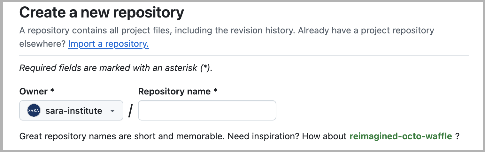{width=70%}

. . .

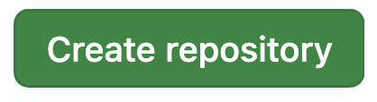{width=40%}

## Copy Repo Link

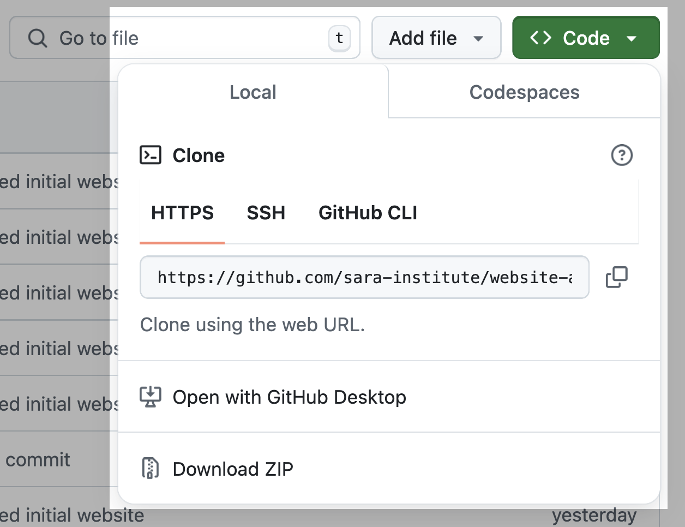{width=70% fig-align=center}

## [Create RStudio Version Control Project]{.r-fit-text}

{width=70% fig-align=center}

## Paste GitHub URL Link here

{width=70% fig-align=center}

# Create<br>Project Files {background-image=images/bg-quarto-files.png background-size=45% background-position=right background-color=silver}

::: footer
Image source: <https://www.avonture.be/blog/quarto-revealjs-tips/>
:::

## Understanding the Project Structure

```.markdown
website-ajay/
├── _quarto.yml
├── index.qmd
├── about.qmd
└── styles.css
```
. . .

::: {.incremental}

1. **`_quarto.yml`** is a **Configuration** file for your website.

1. **`index.qmd`** creates the **homepage** of your website.
    
1. **`about.qmd`** ia an example about **page**.
    
1. **`styles.css`** is **styling** your website using customs CSS.

:::

## Create `_quarto.yml` File 


:::: {.columns}

::: {.column width="50%"}
### Select Text File

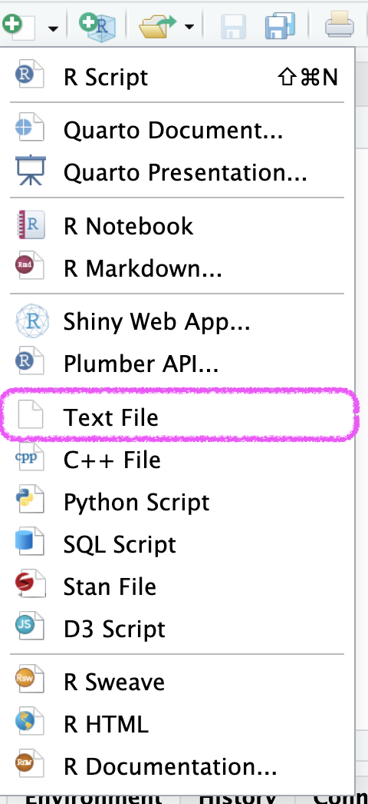{fig-align=center width=40%}
:::

::: {.column width="50%"}

### Change Extension
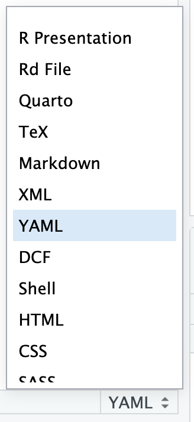{width=40% fig-align=center}
:::

::::

## Edit `_quarto.yml`  {auto-animate=true}

```{.yaml code-line-numbers="1-2|4-5"}
project: 
  type: website

website:
  title: "Dr. Ajay Kumar Koli"
```

<br>

. . .

::: {.callout-caution}
1. The file extension is `.yml` and the selected extension was `YAML`.

1. Refresh the RStudio Project to see the `Build` option.
:::


## Create the Homepage

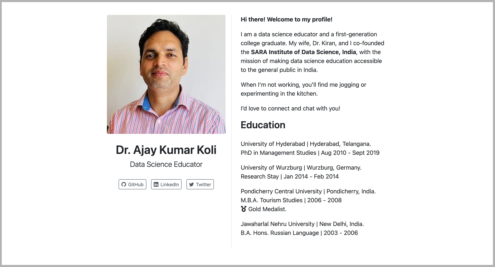

## Edit `index.qmd` {auto-animate=true}

```{.yaml code-line-numbers="1-3|4|5-6|7-10|7-17|19-21|23-29|31-35"}
---
title: "Dr. Ajay Kumar Koli"
subtitle: "Data Science Educator <br>Co-founder of SARA"
image: images/ajay.jpeg
about:
  template: trestles
  links:
    - icon: github
      text: GitHub
      href: https://github.com/sara-institute
    - icon: linkedin
      text: LinkedIn
      href: https://www.linkedin.com/in/ajay-kumar-koli/
    - icon: twitter
      text: Twitter
      href: https://www.linkedin.com/in/ajay-kumar-koli/
---

Ajay Kumar is the Chief Data Scientist at Wengo Analytics. 
When not innovating on data platforms, Finley enjoys spending time
unicycling and playing with her pet iguana.

## Education

University of California, San Diego | San Diego, CA
PhD in Mathematics | Sept 2011 - June 2015

Macalester College | St. Paul, MN
B.A in Economics | Sept 2007 - June 2011

## Experience

Wengo Analytics | Head Data Scientist | April 2018 - present

GeoScynce | Chief Analyst | Spet 2012 - April 2018


```

## Built-In Templates, edit `index.qmd`

:::: {.columns}

::: {.column width="50%"}

- `jolla`

- `trestles`

- `solana`

- `marquee`

- `broadside`
:::

::: {.column width="50%"}
```yaml
---
about:
  template: trestles
---
```
:::

::::

::: footer
More information here <https://quarto.org/docs/websites/website-about.html#templates>
:::

## Website Navigation Bar

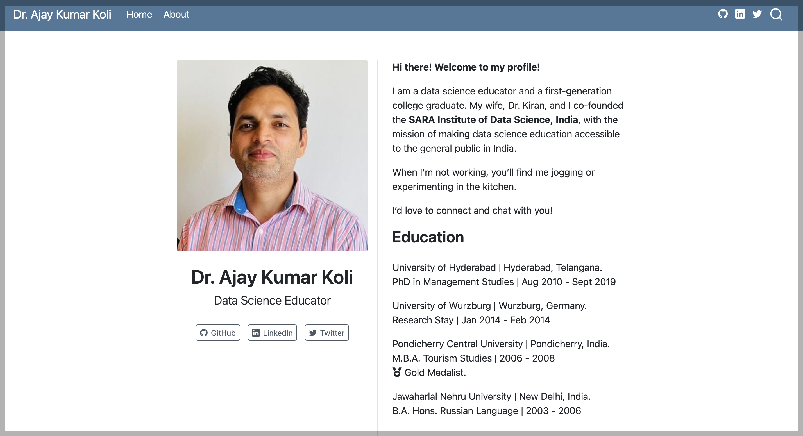

## Edit `_quarto.yml`

```{.yaml code-line-numbers="6-9|10-11|12-18|19-21"}
project: 
  type: website

website:
  title: "Dr. Ajay Kumar Koli"
  navbar:
    left:
      - text: "Home"
        href: index.qmd
      - text: "About"
        href: about.qmd
    tools:
      - icon: github
        href: https://github.com/koliajaykr
      - icon: linkedin
        href: https://www.linkedin.com/in/ajay-kumar-koli/
      - icon: twitter
        href: https://x.com/ajay_kolii
  page-footer: 
    left: "Copyright 2021, Norah Jones"
    right: "Made with Quarto & 💙"
```


## 🤯 Your Turn{background-color="#003262"}

```{r}
library(countdown)

countdown(minutes = 15, top = 0)
```

<br>

### Add an "About" Page to Your Quarto Website

<br>

::: {.callout-note collapse="true" title="💡 Hints"}

- Create a new file called `about.qmd`

- Use `href:` to add it to the navbar in `_quarto.yml`

- A clickable email link in Markdown looks like: `[text](mailto:you@example.com)`

:::

## ✅ Answer  {background-color="#156A6B"}

### Step 1 - Create `about.qmd`

```yaml
---
title: "About"
---

Hi, I'm Ajay Kumar, a data scientist based in New York.
I specialize in R, machine learning, and data visualization.
Feel free to reach out — I love connecting with like-minded people!

📧 [koliajaykumar@gmail.com](mailto:koliajaykumar@gmail.com)

```

## ✅ Answer  {background-color="#156A6B"}

### Step 2 - Update `_quarto.yml`

```{.yaml code-line-numbers="10-11"}
project:
  type: website

website:
  title: "Ajay Kumar"
  navbar:
    left:
      - href: index.qmd
        text: Home
      - href: about.qmd
        text: About
        
```


## Themes; edit `_quarto.yml`

```yaml
format:
  html:
    theme: cosmo
```

<br>

. . .

```yaml
theme: default # bootstrap 5 default
theme: cosmo   # cosmo bootswatch theme
theme: pandoc  # pandoc default html treatment
theme: none    # no theme css added to document
```

::: footer
More about HTML themes <https://quarto.org/docs/output-formats/html-themes.html>
:::


## Customise Website Appearance

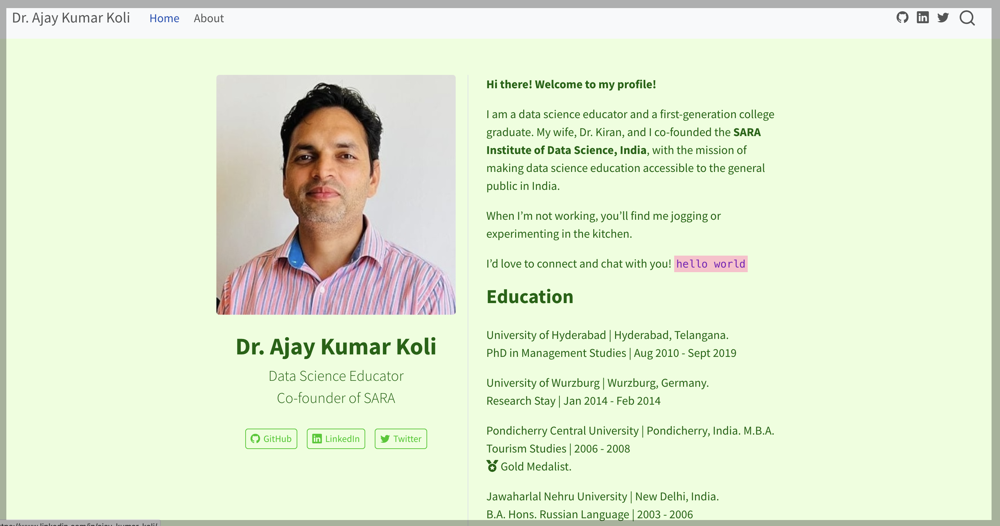

## Customize Colors; edit `_quarto.yml`

> ["If you are using a Bootstrap theme or the Pandoc theme, there are a set of options you can provide in document metadata to customize its appearance."]{.rn-fragment}

. . .

- `fontcolor`: The main color for text on the site.

- `linkcolor`: Color of the links.

- `backgroundcolor`: Background color of the whole site.

- `monobackgroundcolor`: Background color for code chunk.

::: footer
Learn more about HTML colors <https://www.canva.com/colors/>
:::

## Colors; edit `_quarto.yml`

```yaml
format:
  html:
    theme: cosmo
    fontcolor: darkgreen
    linkcolor: black
    backgroundcolor: "#ECFFDC"
    monobackgroundcolor: pink
```

{fig-align=center}

## Customize Fonts; edit `_quarto.yml`

```{.yaml code-line-numbers="8"}
format:
  html:
    theme: cosmo
    fontcolor: darkgreen
    linkcolor: black
    backgroundcolor: "#ECFFDC"
    monobackgroundcolor: pink
    mainfont: "monospace"
```

<br>

. . .

`mainfont` - Sets the font-family property for the document. Also try sans-serif, serif, cursive or system-ui

::: footer
Learn more about font-family <https://developer.mozilla.org/en-US/docs/Web/CSS/Reference/Properties/font-family>
:::

## Your Style/Theme using CSS

<br>

:::: {.columns}

::: {.column width="30%"}

:::

::: {.column width="70%"}
- Cascading Style Sheets (CSS) is a style sheet language.

- CSS is used for specifying the presentation and styling of a document written in a markup language such as HTML
:::

::::

::: footer
Image source <https://giphy.com/gifs/HostGator-webhosting-hostgator-webhost-fuJPZBIIqzbt1kAYVc>      
Source <https://en.wikipedia.org/wiki/CSS>
:::

## Add Style File; edit `_quarto.yml`

```{.yaml code-line-numbers=4}
format:
  html:
    theme: cosmo
    css: styles.css
```

<br>

. . .

Codes for the CSS file

```css
body {
  font-family: Arial, sans-serif;
  background-color: #f0f0f0;
}

h1 {
  color: #333;
}

```

::: footer
Also check out [SCSS](https://sass-lang.com/).    
Learn more about CSS: <https://www.w3schools.com/css/default.asp>
:::

## {background-color=black background-image="https://media1.giphy.com/media/v1.Y2lkPTc5MGI3NjExYjM0d2twY3l3eWU4ZjYxNXNieTYxM3ZzaWxwMG1wNTZmb2xybWNteiZlcD12MV9pbnRlcm5hbF9naWZfYnlfaWQmY3Q9Zw/8PpFJcG4y8HqsxQumz/giphy.gif" background-size=35%}

Imagine a world where all websites are responsive

<!-- 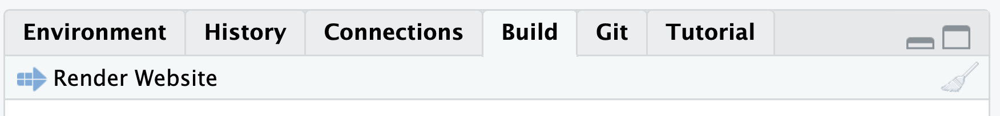 -->

<!-- 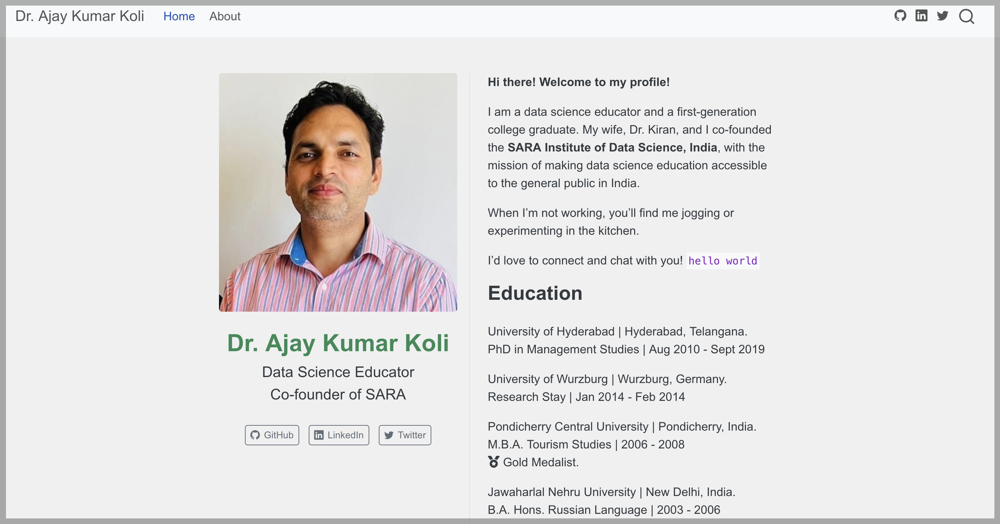 -->

::: footer
GIF source <https://giphy.com/gifs/animation-gif-artist-trapped-8PpFJcG4y8HqsxQumz>
:::

# 🚀 Launch Your Website {background-color=silver}

## Push Your Files to GitHub

Tick First Box $\rightarrow$ Ctrl + a $\rightarrow$ Tick Second Box

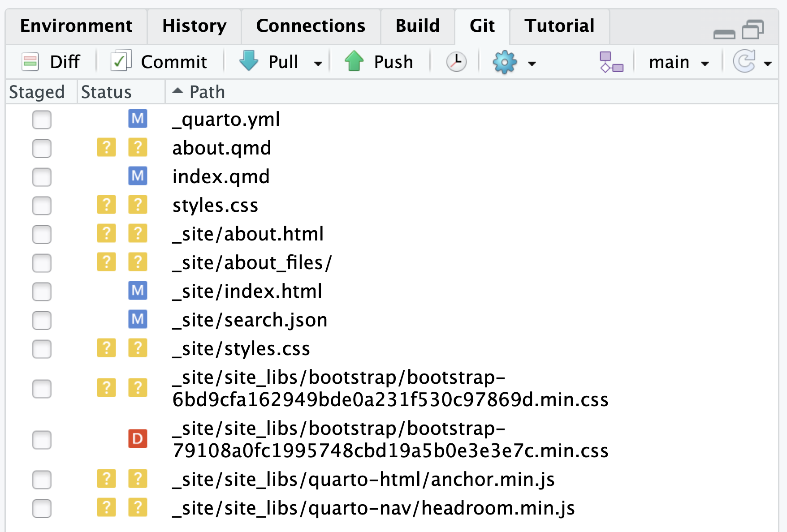

## Select Files and Click `Commit`

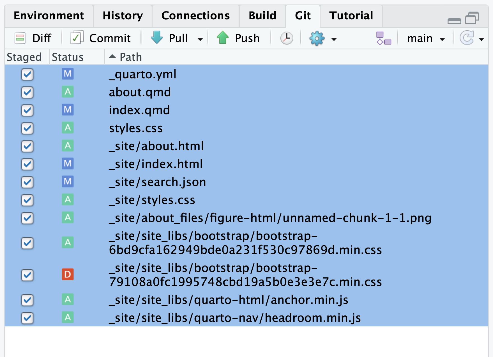

## Write Commit Message and click `Commit`

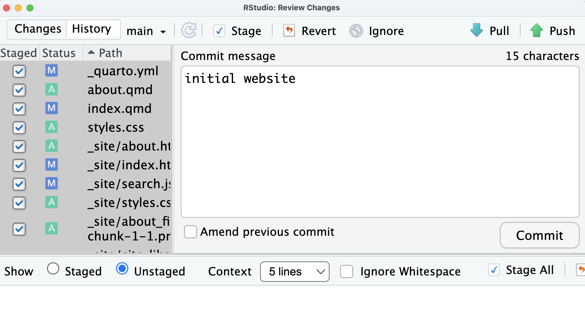

## Let it Run and Close

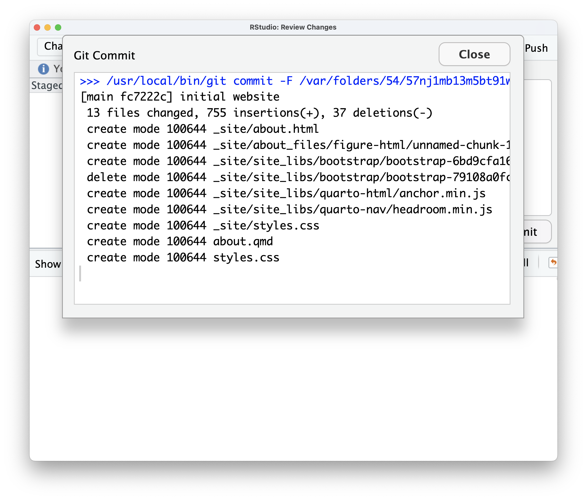

## Branch Ahead Origin and click `Push`

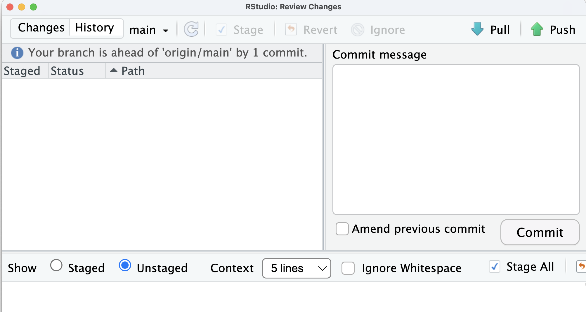

## Let it Run, Close Commit Dialog Boxes

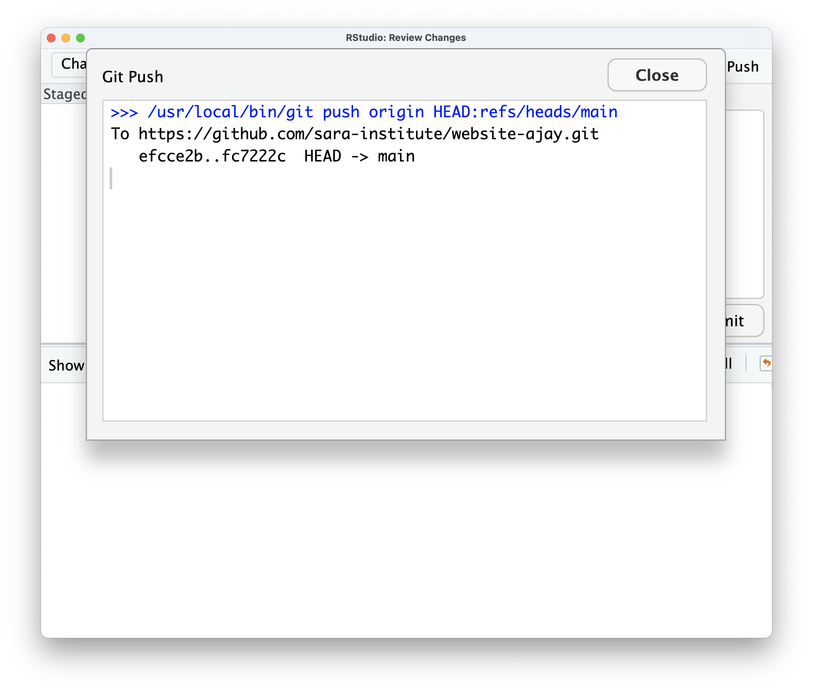

## Check GitHub Repo for Latest Updates

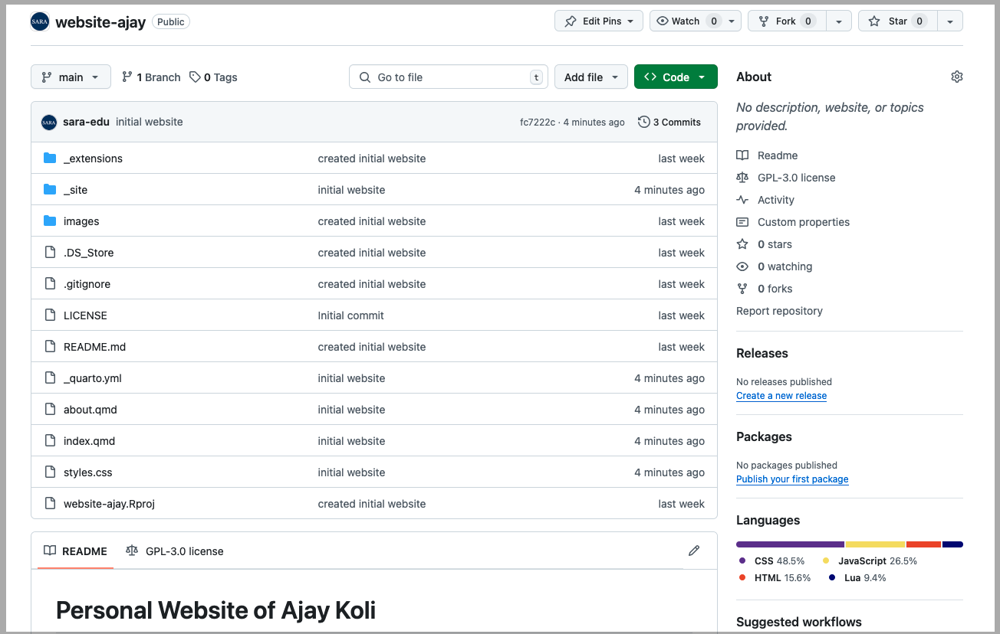

## Open Netlify Website

```{=html}
<iframe width="780" height="500" src="https://www.netlify.com/" title="Webpage example"></iframe>
```

::: {.aside}
Log-in using your github user-name and password.
:::

## Netlify

Add New Site $\rightarrow$ Import an Existing Project $\rightarrow$ Choose GitHub

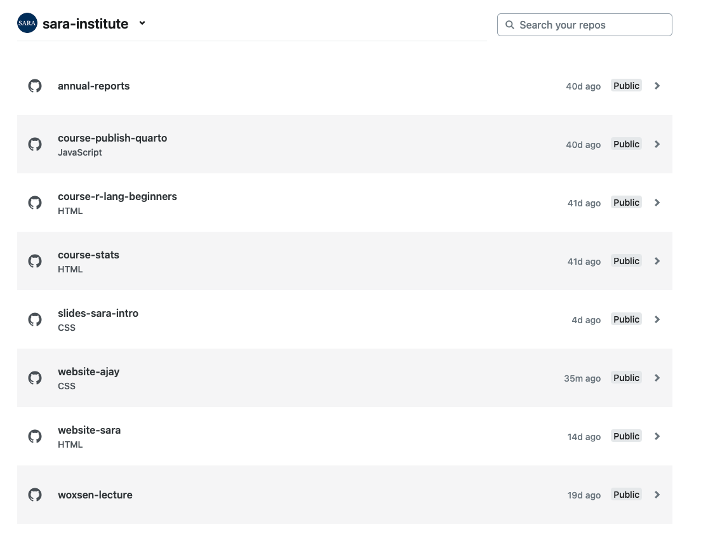{fig-align=center}

## Netlify

- In Publish Directory box write `_site` 

- Deploy website-ajay $\rightarrow$ Site deploy in progress

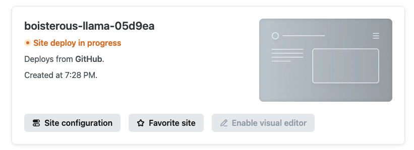

## Site Published, Configure Site

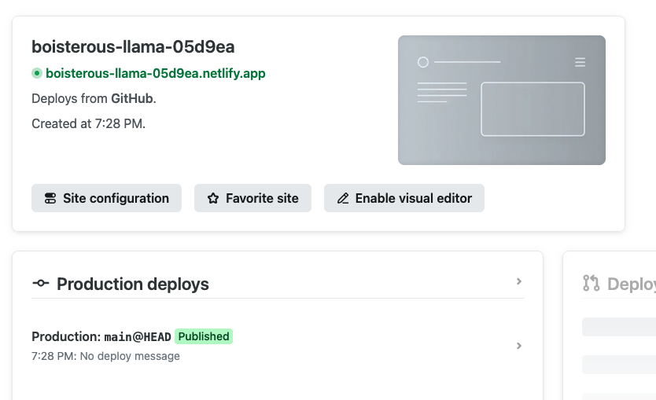

## Change Site Name

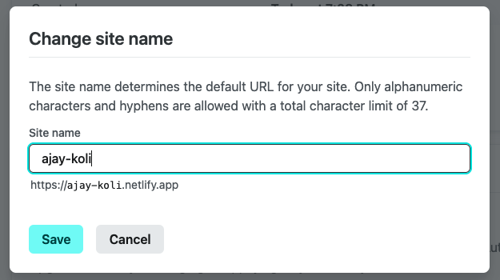

## Site Thumbnail with updated URL

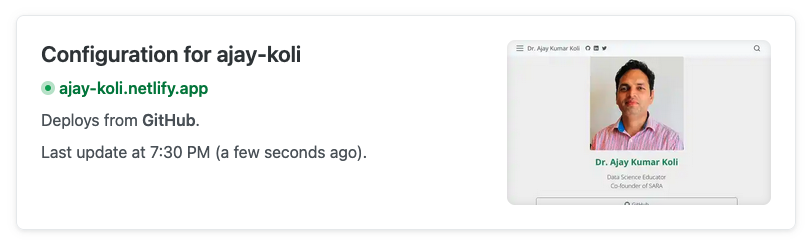

::: notes



:::

## {background-color=black background-image="https://cdn.prod.website-files.com/64fa82cbdeed167ebaefef84/64fa868fecc183a3dd76ab72_603ec5023c4ad83b06783427_ERDRXg1TvG60WlNMOmdqI1UU4cXkbLIokPeCl4ZKyUOdfkCy4Ju7brzIdfWUuo4E-WoK4l9FzYaV8rVhe9wFG-aKiOHf_hAjlxPa9S2FRqipCoAqR6Na6eOpdanMJ39w_u51RDvc.jpeg" background-size=50%}

